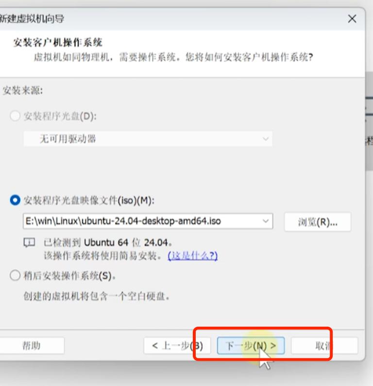
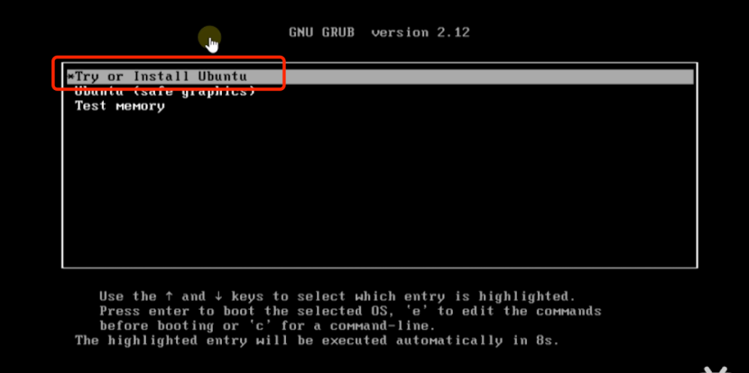
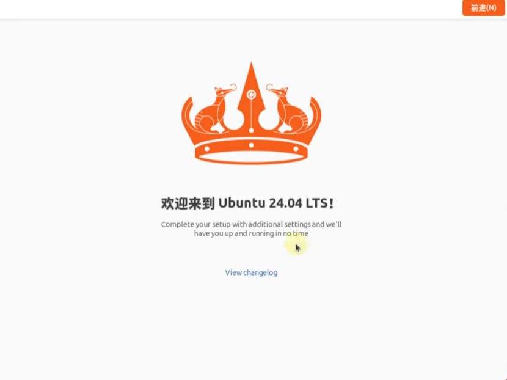

# #3

-----

## 虚拟机安装

### 一、下载及安装VMware


不知名网站下载并安装vmware17

### 二、安装Ubuntu 24.04

从阿里云、清华同方等网站获取镜像文件

安装（设置虚拟机名称和存储路径、分配虚拟机硬盘空间、调整虚拟机硬件参数过程省略）


### 三、虚拟机内Ubuntu 24.04 系统安装


（过程省略）印象中安装用了一个小时

安装完成！


### 四、网络配置

使用桥接模式时发现无网络


改为NAT有网络


更改网卡后刷新有网络


-----

## SSH + VS Code Remote连接虚拟机

### 一、配置ssh服务器

```bash
sudo apt update
sudo apt install openssh-server -y  # 安装SSH服务器:cite[2]:cite[5]
sudo systemctl enable ssh          # 设置开机自启:cite[5]:cite[7]
sudo systemctl start ssh           # 立即启动SSH服务:cite[5]:cite[7]
```

Ubuntu自带ssh

查询服务器状态


### 二、获取ip并连接

```bash
    ip a
```


来自deep：
>>·桥接模式 (Bridged)：虚拟机通常直接获取局域网 IP，本地机与虚拟机IP通常在同一网段（如本地机 192.168.1.100，虚拟机 192.168.1.105），一般首选此模式。  
>>·NAT 模式：虚拟机可能在一个虚拟网络中，需在虚拟化软件（如 VirtualBox 或 VMware）中配置端口转发。
例如，在 VirtualBox 中：
选择虚拟机 > 设置 > 网络 > 高级 > 端口转发
添加规则：主机端口（例如 2222），子系统端口（22）
连接时使用 127.0.0.1:2222

SSH输入密码时不会显示，让我在当时登陆错误时一直觉得是我密码输错了，最后发现虚拟机为桥接模式，ip应该是'192.'开头，而非'127.0'开头  
(又在跟网上乱七八糟的教程了。。。)

`10-19`
重新连接时出现connection time_out报错  
仔细观察后发现是ip地址换了，可能是改变了网络连接的原因
重新连接（已在虚拟机添加本机公钥，已免密）


### 三、VS Code Remote

下完拓展后在侧边栏打开


因为ip更换此处重新配置

配置完成，可在新窗口远程开发

### 四、免密SSH

大致流程就是：获取客户端公钥，让服务器端本地保存公钥

因为没截图不做过程描述，不过倒是不知道为什么当时配置时Ubuntu的添加公钥代码用不了，只能手动在文件末尾添加公钥
